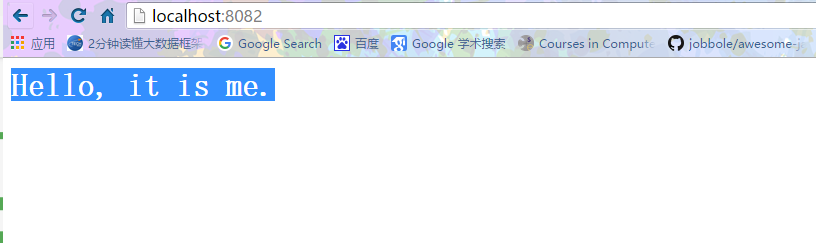
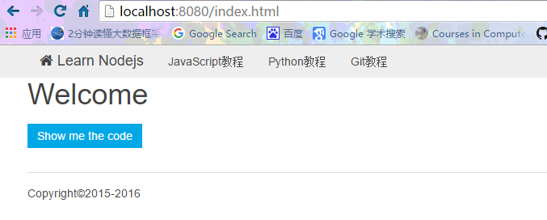

# HTTP

`Node.js`开发的目的就是为了用`JavaScript`编写`Web`服务器程序。因为`JavaScript`实际上已经统治了浏览器端的脚本，其优势就是有世界上数量最多的前端开发人员。如果已经掌握了`JavaScript`前端开发，再学习一下如何将`JavaScript`应用在后端开发，就是名副其实的全栈了。

## HTTP协议

要理解`Web`服务器程序的工作原理，首先，我们要对`HTTP`协议有基本的了解。如果你对`HTTP`协议不太熟悉，先看一看`HTTP`协议简介。

## HTTP服务器

要开发`HTTP`服务器程序，从头处理`TCP连接`，解析`HTTP`是不现实的。这些工作实际上已经由`Node.js`自带的`http`模块完成了。应用程序并不直接和`HTTP`协议打交道，而是操作`http`模块提供的`request`和`response`对象。

`request`对象封装了`HTTP`请求，我们调用`request`对象的属性和方法就可以拿到所有`HTTP`请求的信息；

`response`对象封装了`HTTP`响应，我们操作`response`对象的方法，就可以把`HTTP`响应返回给浏览器。

用`Node.js`实现一个`HTTP`服务器程序非常简单。我们来实现一个最简单的`Web`程序`home.js`，它对于所有请求，都返回`Hello world!`：
```JavaScript
//对应的代码文件:home.js
'use strict';

// 导入http模块:
var http = require('http');

// 创建http server，并传入回调函数:
var server = http.createServer(function (request, response) {
    // 回调函数接收request和response对象,
    // 获得HTTP请求的method和url:
    console.log(request.method + ': ' + request.url);
    // 将HTTP响应200写入response, 同时设置Content-Type: text/html:
    response.writeHead(200, {'Content-Type': 'text/html'});
    // 将HTTP响应的HTML内容写入response:
    response.end('<h1>Hello world!</h1>');
});

// 让服务器监听8082端口:
server.listen(8082);

console.log('Server is running at http://127.0.0.1:8082/');
```
在命令提示符下运行该程序(`node home.js`)，可以看到以下输出：
```JavaScript
Administrator@XB-201606171743 MINGW64 /d/nodejs/http
$ ls
home.js  node_modules/  README.md

Administrator@XB-201606171743 MINGW64 /d/nodejs/http
$ node home.js
server is running at http://127.0.0.1:8082

```
不要关闭命令提示符，直接打开浏览器输入`http://localhost:8082`，即可看到服务器响应的内容：
```JavaScript
Hello, it is me.
```
同时，在命令提示符窗口，可以看到程序打印的请求信息：
```JavaScript
GET/
GET/favicon.ico
```
这就是我们编写的第一个`HTTP`服务器程序！

## 文件服务器

让我们继续扩展一下上面的`Web`程序。我们可以设定一个目录，然后让`Web`程序变成一个文件服务器。要实现这一点，我们只需要解析`request.url`中的路径，然后在本地找到对应的文件，把文件内容发送出去就可以了。

解析`URL`需要用到`Node.js`提供的`url模块`，它使用起来非常简单，通过`parse()`将一个字符串解析为一个`Url`对象：
```JavaScript
//对应的代码文件:urlParse.js
'use strict';

//1. 加载url模块
var url = require('url');

//2. 构造一个待解析的url地址
var uri = "http://localhost.com:8082/path/to/file?query=string#hash";

//3. 解析
var data = url.parse(uri);
console.log(data);

//4. 运行:node urlParse.js
```
结果如下：
```JavaScript
$ ls
home.js  node_modules/  p1.png  README.md  urlParse.js

Administrator@XB-201606171743 MINGW64 /d/nodejs/nodejs-learning/http (master)
$ node urlParse.js
Url {
  protocol: 'http:',
  slashes: true,
  auth: null,
  host: 'localhost.com:8082',
  port: '8082',
  hostname: 'localhost.com',
  hash: '#hash',
  search: '?query=string',
  query: 'query=string',
  pathname: '/path/to/file',
  path: '/path/to/file?query=string',
  href: 'http://localhost.com:8082/path/to/file?query=string#hash' }
```
处理本地文件目录需要使用`Node.js`提供的`path`模块，它可以方便地构造目录：
```JavaScript
'use strict';

var path = require('path');

// 解析当前目录:
var workDir = path.resolve('.'); // '/Users/michael'

// 组合完整的文件路径:当前目录+'pub'+'index.html':
var filePath = path.join(workDir, 'pub', 'index.html');
// '/Users/michael/pub/index.html'
```
使用`path`模块可以正确处理操作系统相关的文件路径。在`Windows`系统下，返回的路径类似于`C:\Users\michael\static\index.html`，这样，我们就不关心怎么拼接路径了。

最后，我们实现一个文件服务器fileServer.js：
```JavaScript
//对应的代码文件:fileServer.js
'use strict';

var
    fs = require('fs'),
    url = require('url'),
    path = require('path'),
    http = require('http');

// 从命令行参数获取root目录，默认是当前目录:
var root = path.resolve(process.argv[2] || '.');

console.log('Static root dir: ' + root);

// 创建服务器:
var server = http.createServer(function (request, response) {
    // 获得URL的path，类似 '/css/bootstrap.css':
    var pathname = url.parse(request.url).pathname;
    // 获得对应的本地文件路径，类似 '/srv/www/css/bootstrap.css':
    var filepath = path.join(root, pathname);
    // 获取文件状态:
    fs.stat(filepath, function (err, stats) {
        if (!err && stats.isFile()) {
            // 没有出错并且文件存在:
            console.log('200 ' + request.url);
            // 发送200响应:
            response.writeHead(200);
            // 将文件流导向response:
            fs.createReadStream(filepath).pipe(response);
        } else {
            // 出错了或者文件不存在:
            console.log('404 ' + request.url);
            // 发送404响应:
            response.writeHead(404);
            response.end('404 Not Found');
        }
    });
});

server.listen(8080);

console.log('Server is running at http://127.0.0.1:8080/');
```
没有必要手动读取文件内容。由于`response`对象本身是一个`Writable Stream`，直接用`pipe()`方法就实现了自动读取文件内容并输出到`HTTP`响应。

在命令行中输入
```
Administrator@XB-201606171743 MINGW64 /d/nodejs/nodejs-learning/http (master)
$ ls
fileServer.js  node_modules/  README.md  url.js
home.js        p1.png         static/    urlParse.js

Administrator@XB-201606171743 MINGW64 /d/nodejs/nodejs-learning/http (master)
$ ls static/
css/  fonts/  index.html  js/

Administrator@XB-201606171743 MINGW64 /d/nodejs/nodejs-learning/http (master)
$ pwd
/d/nodejs/nodejs-learning/http

Administrator@XB-201606171743 MINGW64 /d/nodejs/nodejs-learning/http (master)
$ node fileServer.js d:/nodejs/nodejs-learning/http/static
Static root dir: d:\nodejs\nodejs-learning\http\static
Server is running at http://127.0.0.1:8080/
```
然后在浏览器中输入http://localhost:8080/index.html：



只要当前目录下存在文件`index.html`，服务器就可以把文件内容发送给浏览器。观察控制台输出：
```
200 /index.html
200 /css/uikit.min.css
200 /js/jquery.min.js
200 /fonts/fontawesome-webfont.woff2
```
第一个请求是浏览器请求`index.html`页面，后续请求是浏览器解析`HTML`后发送的其它资源请求。

## 练习

在浏览器输入`http://localhost:8080/`时，会返回`404`，原因是程序识别出`HTTP`请求的不是文件，而是目录。请修改`file_server.js`，如果遇到请求的路径是目录，则自动在目录下依次搜索`index.html、default.html`，如果找到了，就返回`HTML`文件的内容。
参考代码如下：
```
'use strict';
//导入fs,url,path,http模块
var
    fs = require('fs'),
    http = require('http'),
    url = require('url'),
    path = require('path');

//获取root路径
var root = path.resolve(process.argv[2] || '');

console.log('Static root dir: ' + root);

//创建server
var server = http.createServer(function(request, response) {
    //'static/bootstrap.css'
    var pathname = url.parse(request.url).pathname,
        //'/srv/www/static/bootstrap.css'
        filepath = path.join(root, pathname);
    fs.stat(filepath, function(err, stats) {
        if (!err && stats.isFile()) {
            console.log('200 ' + request.url);
            response.writeHead(200);
            fs.createReadStream(filepath).pipe(response);
        } else if (!err && stats.isDirectory()) {
            if (pathname == "/") {
                // 判断是否以http://127.0.0.1:8080访问首页
                fs.readdir(filepath, function(err, files) {
                    // 读取根目录
                    if (err) {
                        // 出错了或者文件不存在:
                        console.log('404 ' + request.url);
                        // 发送404响应:
                        response.writeHead(404);
                        response.end('404 Not Found');
                    } else {
                        // 根目录文件存在
                        var index = '';
                        // 遍历根目录是否存在index.html
                        files.map(function(f) {
                            if (f === 'index.html') index = f;
                        });
                        if (!index) {
                            // index.html不存在，再进行二次遍历查找default.html
                            files.map(function(f) {
                                if (f === 'default.html') index = f;
                            });
                            // 两个首页同时都不存在，反馈首页不存在
                            if (!index) {
                                // 出错了或者文件不存在:
                                console.log('404 ' + request.url);
                                // 发送404响应:
                                response.writeHead(404);
                                response.end('404 Index Not Found');
                            }
                        }
                        // 进行到这里，index不为空，总会有一个首页存在
                        // 设置首页本地路径地址
                        var page = path.join(root, index);
                        console.log('200 ' + page);
                        response.writeHead(200);
                        fs.createReadStream(page).pipe(response);
                    }
                });
            } else {
                fs.readdir(filepath, function(err, files) {
                    if (err) {
                        console.log('file not found in this dir');
                    } else {
                        console.log('below is file list');
                        var list = '<!DOCTYPE html><head><meta charset="utf-8"><title>hehe</title></head><body>';
                        files.map(function(f) {
                            var hrefpath = path.join(pathname, f);
                            list += '<a href="' + hrefpath + '">' + f + '</a><br>'
                        });
                        list += '</body></html>';
                        response.end(list);
                    }
                });
            }
        } else {
            // 出错了或者文件不存在:
            console.log('404 ' + request.url);
            // 发送404响应:
            response.writeHead(404);
            response.end('404 Not Found');
        }
    });
});
server.listen(8080);

console.log('Server is running at http://127.0.0.1:8080/');
```