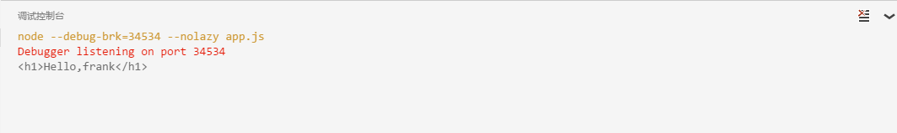
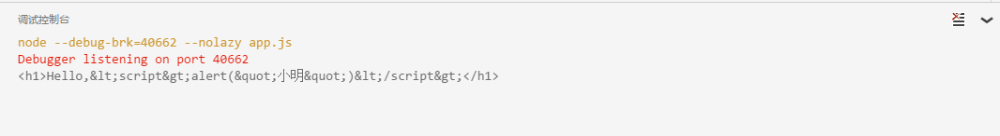
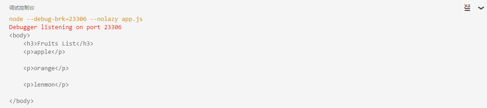
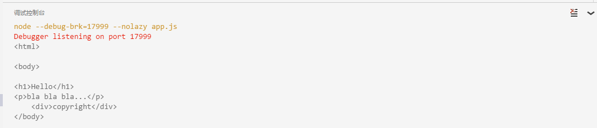

## Nunjucks

`Nunjucks`是什么东东？其实它是一个模板引擎。

那什么是模板引擎？

模板引擎就是基于模板配合数据构造出字符串输出的一个组件。比如下面的函数就是一个模板引擎：
```JavaScript
function examResult (data) {
    return `${data.name}同学一年级期末考试语文${data.chinese}分，数学${data.math}分，位于年级第${data.ranking}名。`
}
```
如果我们输入数据如下：
```JavaScript
examResult({
    name: '小明',
    chinese: 78,
    math: 87,
    ranking: 999
});
```
该模板引擎把模板字符串里面对应的变量替换以后，就可以得到以下输出：

小明同学一年级期末考试语文`78`分，数学`87`分，位于年级第`999`名。
模板引擎最常见的输出就是输出网页，也就是`HTML文本`。当然，也可以输出任意格式的文本，比如`Text`，`XML`，`Markdown`等等。

有同学要问了：既然`JavaScript`的模板字符串可以实现模板功能，那为什么我们还需要另外的模板引擎？

因为`JavaScript`的模板字符串必须写在`JavaScript`代码中，要想写出新浪首页这样复杂的页面，是非常困难的。

输出`HTML`有几个特别重要的问题需要考虑：

1. 转义

对特殊字符要转义，避免受到`XSS攻击`。比如，如果变量`name`的值不是小明，而是小明`<script>...</script>`，模板引擎输出的`HTML`到了浏览器，就会自动执行恶意`JavaScript`代码。

2. 格式化

对不同类型的变量要格式化，比如，货币需要变成`12,345.00`这样的格式，日期需要变成`2016-01-01`这样的格式。

3. 简单逻辑

模板还需要能执行一些简单逻辑，比如，要按条件输出内容，需要`if`实现如下输出：
```html
{{ name }}同学，

    成绩优秀，应该奖励

    成绩良好，继续努力

    不及格，建议回家打屁股

```
所以，我们需要一个功能强大的模板引擎，来完成页面输出的功能。

## Nunjucks

我们选择`Nunjucks`作为模板引擎。`Nunjucks`是`Mozilla`开发的一个纯`JavaScript`编写的模板引擎，既可以用在`Node`环境下，又可以运行在浏览器端。但是，主要还是运行在`Node`环境下，因为浏览器端有更好的模板解决方案，例如`MVVM框架`。

如果你使用过`Python`的模板引擎`jinja2`，那么使用`Nunjucks`就非常简单，两者的语法几乎是一模一样的，因为`Nunjucks`就是用`JavaScript`重新实现了`jinjia2`。

从上面的例子我们可以看到，虽然模板引擎内部可能非常复杂，但是使用一个模板引擎是非常简单的，因为本质上我们只需要构造这样一个函数：
```JavaScript
function render(view, model) {
    // TODO:...
}
```
其中，`view`是模板的名称（又称为视图），因为可能存在多个模板，需要选择其中一个。`model`就是数据，在`JavaScript`中，它就是一个简单的`Object`。`render函数`返回一个`字符串`，就是`模板的输出`。

下面我们来使用`Nunjucks`这个模板引擎来编写几个`HTML`模板，并且用实际数据来渲染模板并获得最终的`HTML`输出。

我们创建一个nunjucks的VS Code工程结构如下：
```
nunjucks/
|
+- .vscode/
|  |
|  +- launch.json <-- VSCode 配置文件
|
+- views/
|  |
|  +- hello.html <-- HTML模板文件
|
+- app.js <-- 入口js
|
+- package.json <-- 项目描述文件
|
+- node_modules/ <-- npm安装的所有依赖包
```
其中，模板文件存放在`views`目录中。

我们先在`package.json`中添加`nunjucks`的依赖：
```JavaScript
"nunjucks": "2.4.2"
```
注意，模板引擎是可以独立使用的，并不需要依赖`koa`。用`npm install`安装所有依赖包。
```
Administrator@XB-201606171743 MINGW64 /d/nodejs/nodejs-learning/web/koa/Nunjucks (master)
$ npm install
NUNJUCKS@1.0.0 D:\nodejs\nodejs-learning\web\koa\Nunjucks
`-- nunjucks@2.4.2
  +-- asap@2.0.4
  +-- chokidar@1.6.0
  | +-- anymatch@1.3.0
  | | +-- arrify@1.0.1
  | | `-- micromatch@2.3.11
  | |   +-- arr-diff@2.0.0
  | |   | `-- arr-flatten@1.0.1
  | |   +-- array-unique@0.2.1
  | |   +-- braces@1.8.5
  | |   | +-- expand-range@1.8.2
  | |   | | `-- fill-range@2.2.3
  | |   | |   +-- is-number@2.1.0
  | |   | |   +-- isobject@2.1.0
  | |   | |   +-- randomatic@1.1.5
  | |   | |   `-- repeat-string@1.5.4
  | |   | +-- preserve@0.2.0
  | |   | `-- repeat-element@1.1.2
  | |   +-- expand-brackets@0.1.5
  | |   | `-- is-posix-bracket@0.1.1
  | |   +-- extglob@0.3.2
  | |   +-- filename-regex@2.0.0
  | |   +-- kind-of@3.0.4
  | |   | `-- is-buffer@1.1.4
  | |   +-- normalize-path@2.0.1
  | |   +-- object.omit@2.0.0
  | |   | +-- for-own@0.1.4
  | |   | | `-- for-in@0.1.5
  | |   | `-- is-extendable@0.1.1
  | |   +-- parse-glob@3.0.4
  | |   | +-- glob-base@0.3.0
  | |   | `-- is-dotfile@1.0.2
  | |   `-- regex-cache@0.4.3
  | |     +-- is-equal-shallow@0.1.3
  | |     `-- is-primitive@2.0.0
  | +-- async-each@1.0.1
  | +-- glob-parent@2.0.0
  | +-- inherits@2.0.1
  | +-- is-binary-path@1.0.1
  | | `-- binary-extensions@1.5.0
  | +-- is-glob@2.0.1
  | | `-- is-extglob@1.0.0
  | +-- path-is-absolute@1.0.0
  | `-- readdirp@2.1.0
  |   +-- graceful-fs@4.1.6
  |   +-- minimatch@3.0.3
  |   | `-- brace-expansion@1.1.6
  |   |   +-- balanced-match@0.4.2
  |   |   `-- concat-map@0.0.1
  |   +-- readable-stream@2.1.5
  |   | +-- buffer-shims@1.0.0
  |   | +-- core-util-is@1.0.2
  |   | +-- isarray@1.0.0
  |   | +-- process-nextick-args@1.0.7
  |   | +-- string_decoder@0.10.31
  |   | `-- util-deprecate@1.0.2
  |   `-- set-immediate-shim@1.0.1
  `-- yargs@3.32.0
    +-- camelcase@2.1.1
    +-- cliui@3.2.0
    | +-- strip-ansi@3.0.1
    | | `-- ansi-regex@2.0.0
    | `-- wrap-ansi@2.0.0
    +-- decamelize@1.2.0
    +-- os-locale@1.4.0
    | `-- lcid@1.0.0
    |   `-- invert-kv@1.0.0
    +-- string-width@1.0.2
    | +-- code-point-at@1.0.0
    | | `-- number-is-nan@1.0.0
    | `-- is-fullwidth-code-point@1.0.0
    +-- window-size@0.1.4
    `-- y18n@3.2.1

npm WARN optional Skipping failed optional dependency /chokidar/fsevents:
npm WARN notsup Not compatible with your operating system or architecture: fsevents@1.0.14
npm WARN NUNJUCKS@1.0.0 No repository field.
npm WARN NUNJUCKS@1.0.0 No license field.
```

紧接着，我们要编写使用`Nunjucks`的函数`render`。怎么写？方法是查看`Nunjucks`的官方文档，仔细阅读后，在`app.js`中编写代码如下：
```JavaScript
const nunjucks = require('nunjucks');

function createEnv(path, opts) {
    var
        autoescape = opts.autoescape && true,
        noCache = opts.noCache || false,
        watch = opts.watch || false,
        throwOnUndefined = opts.throwOnUndefined || false,
        env = new nunjucks.Environment(
            new nunjucks.FileSystemLoader('views', {
                noCache: noCache,
                watch: watch,
            }), {
                autoescape: autoescape,
                throwOnUndefined: throwOnUndefined
            });
    if (opts.filters) {
        for (var f in opts.filters) {
            env.addFilter(f, opts.filters[f]);
        }
    }
    return env;
}

var env = createEnv('views', {
    watch: true,
    filters: {
        hex: function (n) {
            return '0x' + n.toString(16);
        }
    }
});
```

变量`env`就表示`Nunjucks`模板引擎对象，它有一个`render(view, model)`方法，正好传入`view`和`model`两个参数，并返回字符串。

创建`env`需要的参数可以查看文档获知。我们用`autoescape = opts.autoescape && true`这样的代码给每个参数加上默认值，最后使用`new nunjucks.FileSystemLoader('views')`创建一个文件系统加载器，从`views`目录读取模板。

我们编写一个`hello.html`模板文件，放到`views`目录下，内容如下：
```html
<h1>Hello {{ name }}</h1>
```
然后，我们就可以用下面的代码来渲染这个模板：
```JavaScript
//完整的代码:app1.js
var s = env.render('hello.html', { name: '小明' });
console.log(s);
```

获得输出如下：
```html
<h1>Hello 小明</h1>
```



咋一看，这和使用JavaScript模板字符串没啥区别嘛。不过，试试：
```JavaScript
//完整的代码:app2.js
var s = env.render('hello.html', { name: '<script>alert("小明")</script>' });
console.log(s);
```
获得输出如下：
```html
<h1>Hello &lt;script&gt;alert("小明")&lt;/script&gt;</h1>
```



这样就避免了输出恶意脚本。

此外，可以使用`Nunjucks`提供的功能强大的`tag`，编写条件判断、循环等功能，例如：
```html
//对应的代码文件:fruit.html
<!-- 循环输出名字 -->
<body>
    <h3>Fruits List</h3>
    
    <p>{{ f }}</p>
    
</body>
```
在app.js中修改为
```
//完整的代码：app3.js
var fruits = new Array ( 'apple', 'orange', 'lenmon' );
var s = env.render('fruit.html', { fruits: fruits });

console.log(s);
```


`Nunjucks`模板引擎最强大的功能在于模板的继承。仔细观察各种网站可以发现，网站的结构实际上是类似的，头部、尾部都是固定格式，只有中间页面部分内容不同。如果每个模板都重复头尾，一旦要修改头部或尾部，那就需要改动所有模板。

更好的方式是使用继承。先定义一个基本的网页框架`base.html`：
```html
//对应的代码文件：base.html
<html><body>
 <h3>Unnamed</h3> 
 <div>No body</div> 
 <div>copyright</div> 
</body>
```
`base.html`定义了三个可编辑的块，分别命名为`header`、`body`和`footer`。子模板可以有选择地对块进行重新定义：
```html
//对应的代码文件：extend.html


<h1>{{ header }}</h1>

<p>{{ body }}</p>
```
然后，我们对子模板进行渲染：
```
//对应的代码文件app4.js
console.log(env.render('extend.html', {
    header: 'Hello',
    body: 'bla bla bla...'
}));
```
输出HTML如下：
```html
<html><body>
<h1>Hello</h1>
<p>bla bla bla...</p>
<div>copyright</div> <-- footer没有重定义，所以仍使用父模板的内容
</body>
```



## 性能

最后我们要考虑一下`Nunjucks`的性能。

对于模板渲染本身来说，速度是非常非常快的，因为就是拼字符串嘛，纯`CPU`操作。

性能问题主要出现在从文件读取模板内容这一步。这是一个`IO`操作，在`Node.js`环境中，我们知道，单线程的`JavaScript`最不能忍受的就是`同步IO`，但`Nunjucks`默认就使用`同步IO`读取模板文件。

好消息是`Nunjucks`会缓存已读取的文件内容，也就是说，模板文件最多读取一次，就会放在内存中，后面的请求是不会再次读取文件的，只要我们指定了`noCache: false`这个参数。

在开发环境下，可以关闭`cache`，这样每次重新加载模板，便于实时修改模板。在生产环境下，一定要打开`cache`，这样就不会有性能问题。

`Nunjucks`也提供了异步读取的方式，但是这样写起来很麻烦，有简单的写法我们就不会考虑复杂的写法。保持代码简单是可维护性的关键。