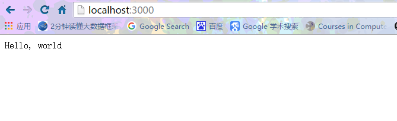

# koa

`koa`是`Express`的下一代基于`Node.js`的`web`框架，目前有`1.x`和`2.0`两个版本。

## 1. Express

`Express`是第一代最流行的`web框架`，它对`Node.js`的`http`进行了封装，用起来如下：
```JavaScript
//对应的代码文件：expressTest.js
var express = require('express');
var app = express();

app.get('/', function (req, res) {
    res.send('Hello World!');
});

app.listen(3000, function () {
    console.log('Example app listening on port 3000!');
});
```
因为使用了`express`，我们需要安装，默认的是没有`express`模块的在命令行中执行
```
Administrator@XB-201606171743 MINGW64 /d/nodejs/nodejs-learning/web/koa (master)
$ npm install express
D:\nodejs\nodejs-learning\web\koa
`-- express@4.14.0
  +-- accepts@1.3.3
  | +-- mime-types@2.1.11
  | | `-- mime-db@1.23.0
  | `-- negotiator@0.6.1
  +-- array-flatten@1.1.1
  +-- content-disposition@0.5.1
  +-- content-type@1.0.2
  +-- cookie@0.3.1
  +-- cookie-signature@1.0.6
  +-- debug@2.2.0
  | `-- ms@0.7.1
  +-- depd@1.1.0
  +-- encodeurl@1.0.1
  +-- escape-html@1.0.3
  +-- etag@1.7.0
  +-- finalhandler@0.5.0
  | +-- statuses@1.3.0
  | `-- unpipe@1.0.0
  +-- fresh@0.3.0
  +-- merge-descriptors@1.0.1
  +-- methods@1.1.2
  +-- on-finished@2.3.0
  | `-- ee-first@1.1.1
  +-- parseurl@1.3.1
  +-- path-to-regexp@0.1.7
  +-- proxy-addr@1.1.2
  | +-- forwarded@0.1.0
  | `-- ipaddr.js@1.1.1
  +-- qs@6.2.0
  +-- range-parser@1.2.0
  +-- send@0.14.1
  | +-- destroy@1.0.4
  | +-- http-errors@1.5.0
  | | +-- inherits@2.0.1
  | | `-- setprototypeof@1.0.1
  | `-- mime@1.3.4
  +-- serve-static@1.11.1
  +-- type-is@1.6.13
  | `-- media-typer@0.3.0
  +-- utils-merge@1.0.0
  `-- vary@1.1.0

npm WARN enoent ENOENT: no such file or directory, open 'D:\nodejs\nodejs-learning\web\koa\package.json'
npm WARN koa No description
npm WARN koa No repository field.
npm WARN koa No README data
npm WARN koa No license field.

Administrator@XB-201606171743 MINGW64 /d/nodejs/nodejs-learning/web/koa (master)
$ ls
expressTest.js  node_modules/  README.md

Administrator@XB-201606171743 MINGW64 /d/nodejs/nodejs-learning/web/koa (master)
$ node expressTest.js
the server is listening at port 3000....

```
在浏览器中访问`http://localhost:3000`，看到的内容如下：



虽然`Express`的API很简单，但是它是基于`ES5`的语法，要实现异步代码，只有一个方法：`回调`。如果异步嵌套层次过多，代码写起来就非常难看：
```JavaScript
//对应的代码文件：expressSync.js
'use strict';

//加载express模块
var express = require('express');

var app = express();

//加载fs模块
var fs = require('fs');

//映射路径
app.get('/test', function(req, res) {
    fs.readFile('file1.txt', function(err, data) {
        if (err) {
            res.status(500).send('read file1 error');
        }
        fs.readFile('file2.txt', function(err, data) {
            if (err) {
                res.status(500).send('read file2 error');
            }
            res.type('text/plain');
            res.send(data);
        });
    });
});

//监听端口
app.listen(3000, function() {
    console.log("the server is listening at port 3000....");
});
```
命令行执行：
```
Administrator@XB-201606171743 MINGW64 /d/nodejs/nodejs-learning/web/koa (master)
$ node expressSync.js
the server is listening at port 3000....
```
浏览器访问`http://localhost:3000/test` :


虽然可以用`async`这样的库来组织异步代码，但是用回调写异步实在是太痛苦了！

## 2. koa 1.0

随着新版`Node.js`开始支持`ES6`，`Express`的团队又基于`ES6`的`generator`重新编写了下一代`web`框架`koa`。和`Express`相比，`koa 1.0`使用`generator`实现异步，代码看起来像同步的：
```JavaScript
//对应的代码文件：expressTest.js
var koa = require('koa');
var app = koa();

app.use('/test', function *() {
    yield doReadFile1();
    var data = yield doReadFile2();
    this.body = data;
});

app.listen(3000);
```
用`generator`实现异步比回调简单了不少，但是`generator`的本意并不是异步。`Promise`才是为异步设计的，但是`Promise`的写法……想想就复杂。为了简化异步代码，`ES7`（目前是草案，还没有发布）引入了新的关键字`async`和`await`，可以轻松地把一个`function`变为异步模式：
```JavaScript
async function () {
    var data = await fs.read('/file1');
}
```
这是`JavaScript`未来标准的异步代码，非常简洁，并且易于使用。

3. koa2

`koa`团队并没有止步于`koa 1.0`，他们非常超前地基于`ES7`开发了`koa2`，和`koa 1`相比，`koa2`完全使用`Promise`并配合`async`来实现异步。

`koa2`的代码看上去像这样：
```JavaScript
app.use(async (ctx, next) => {
    await next();
    var data = await doReadFile();
    ctx.response.type = 'text/plain';
    ctx.response.body = data;
});
```
出于兼容性考虑，目前`koa 2`仍支持`generator`的写法，但下一个版本将会去掉。

选择哪个版本？

目前`JavaScript`处于高速进化中，`ES7`是大势所趋。为了紧跟时代潮流，教程将使用最新的`koa 2`开发！