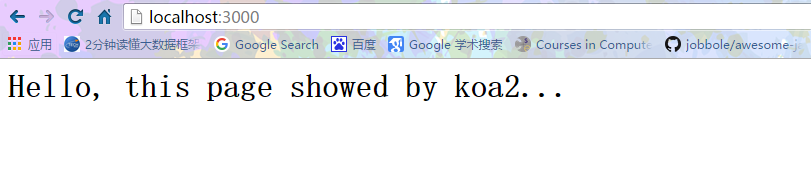
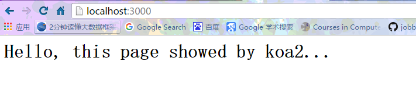
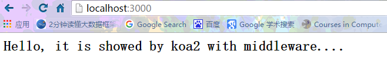
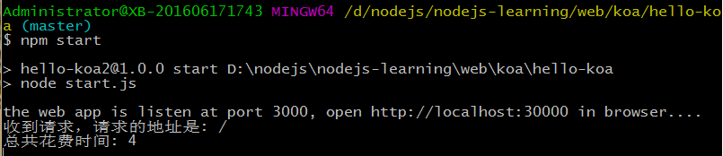

# KOA入门

## 创建koa2工程

首先，我们创建一个目录`hello-koa`并作为工程目录用`VS Code`打开。然后，我们创建`app.js`，输入以下代码：
```
// 导入koa，和koa 1.x不同，在koa2中，我们导入的是一个class，因此用大写的Koa表示:
const Koa = require('koa');

// 创建一个Koa对象表示web app本身:
const app = new Koa();

// 对于任何请求，app将调用该异步函数处理请求：
app.use(async (ctx, next) => {
    await next();
    ctx.response.type = 'text/html';
    ctx.response.body = '<h1>Hello, koa2!</h1>';
});

// 在端口3000监听:
app.listen(3000);
console.log('app started at port 3000...');
```

对于每一个http请求，koa将调用我们传入的异步函数来处理：
```
async (ctx, next) => {
    await next();
    // 设置response的Content-Type:
    ctx.response.type = 'text/html';
    // 设置response的内容:
    ctx.response.body = '<h1>Hello, koa2!</h1>';
}
```
其中，参数`ctx`是由`koa`传入的封装了`request`和`response`的变量，我们可以通过它访问`request`和`response，next`是`koa`传入的将要处理的下一个异步函数。

上面的异步函数中，我们首先用`await next();`处理下一个异步函数，然后，设置`response`的`Content-Type`和内容。

由`async`标记的函数称为异步函数，在异步函数中，可以用`await`调用另一个异步函数，这两个关键字将在`ES7`中引入。

现在我们遇到第一个问题：`koa`这个包怎么装，`app.js`才能正常导入它？

方法一：可以用`npm`命令直接安装`koa`。先打开命令提示符，务必把当前目录切换到`hello-koa`这个目录，然后执行命令：
```
C:\...\hello-koa> npm install koa@2.0.0
```
`npm`会把`koa2`以及`koa2`依赖的所有包全部安装到当前目录的`node_modules`目录下。

方法二：在`hello-koa`这个目录下创建一个`package.json`，这个文件描述了我们的hello-koa工程会用到哪些包。完整的文件内容如下：
```
{
    "name": "hello-koa2",
    "version": "1.0.0",
    "description": "Hello koa2 example with async",
    "main": "start.js",
    "scripts": {
        "start": "node start.js"
    },
    "keywords": [
        "koa",
        "async"
    ],
    "author": "frank",
    "license": "Apache-2.0",
    "dependencies": {
        "babel-core": "6.13.0",
        "babel-polyfill": "6.13.0",
        "babel-preset-es2015-node6": "0.3.0",
        "babel-preset-stage-3": "6.5.0",
        "koa": "2.0.0"
    }
}
```
其中，dependencies描述了我们的工程依赖的包以及版本号。其他字段均用来描述项目信息，可任意填写。

然后，我们在`hello-koa`目录下执行`npm install`就可以把所需包以及依赖包一次性全部装好：
```
$ npm install
hello-koa2@1.0.0 D:\nodejs\nodejs-learning\web\koa\hello-koa
+-- babel-core@6.13.0
| +-- babel-code-frame@6.11.0
| | +-- chalk@1.1.3
| | | +-- ansi-styles@2.2.1
| | | +-- escape-string-regexp@1.0.5
| | | +-- has-ansi@2.0.0
| | | | `-- ansi-regex@2.0.0
| | | +-- strip-ansi@3.0.1
| | | `-- supports-color@2.0.0
| | +-- esutils@2.0.2
| | `-- js-tokens@2.0.0
| +-- babel-generator@6.14.0
| | `-- detect-indent@3.0.1
| |   +-- get-stdin@4.0.1
| |   +-- minimist@1.2.0
| |   `-- repeating@1.1.3
| |     `-- is-finite@1.0.1
| |       `-- number-is-nan@1.0.0
| +-- babel-helpers@6.8.0
| +-- babel-messages@6.8.0
| +-- babel-register@6.14.0
| | +-- babel-core@6.14.0
| | +-- home-or-tmp@1.0.0
| | | +-- os-tmpdir@1.0.1
| | | `-- user-home@1.1.1
| | +-- mkdirp@0.5.1
| | | `-- minimist@0.0.8
| | `-- source-map-support@0.2.10
| |   `-- source-map@0.1.32
| |     `-- amdefine@1.0.0
| +-- babel-runtime@6.11.6
| +-- babel-template@6.14.0
| +-- babel-traverse@6.14.0
| | +-- globals@8.18.0
| | `-- invariant@2.2.1
| |   `-- loose-envify@1.2.0
| |     `-- js-tokens@1.0.3
| +-- babel-types@6.14.0
| | `-- to-fast-properties@1.0.2
| +-- babylon@6.9.1
| +-- convert-source-map@1.3.0
| +-- debug@2.2.0
| | `-- ms@0.7.1
| +-- json5@0.4.0
| +-- lodash@4.15.0
| +-- minimatch@3.0.3
| | `-- brace-expansion@1.1.6
| |   +-- balanced-match@0.4.2
| |   `-- concat-map@0.0.1
| +-- path-exists@1.0.0
| +-- path-is-absolute@1.0.0
| +-- private@0.1.6
| +-- shebang-regex@1.0.0
| +-- slash@1.0.0
| `-- source-map@0.5.6
+-- babel-polyfill@6.13.0
| +-- core-js@2.4.1
| `-- regenerator-runtime@0.9.5
+-- babel-preset-es2015-node6@0.3.0
| +-- babel-plugin-transform-es2015-destructuring@6.9.0
| +-- babel-plugin-transform-es2015-function-name@6.9.0
| | `-- babel-helper-function-name@6.8.0
| +-- babel-plugin-transform-es2015-modules-commonjs@6.14.0
| | `-- babel-plugin-transform-strict-mode@6.11.3
| `-- babel-plugin-transform-es2015-parameters@6.11.4
|   +-- babel-helper-call-delegate@6.8.0
|   | `-- babel-helper-hoist-variables@6.8.0
|   `-- babel-helper-get-function-arity@6.8.0
+-- babel-preset-stage-3@6.5.0
| +-- babel-plugin-transform-async-to-generator@6.8.0
| | +-- babel-helper-remap-async-to-generator@6.11.2
| | `-- babel-plugin-syntax-async-functions@6.13.0
| `-- babel-plugin-transform-exponentiation-operator@6.8.0
|   +-- babel-helper-builder-binary-assignment-operator-visitor@6.8.0
|   | `-- babel-helper-explode-assignable-expression@6.8.0
|   `-- babel-plugin-syntax-exponentiation-operator@6.13.0
`-- koa@2.0.0
  +-- accepts@1.3.3
  | `-- negotiator@0.6.1
  +-- content-disposition@0.5.1
  +-- content-type@1.0.2
  +-- cookies@0.6.1
  | `-- keygrip@1.0.1
  +-- delegates@1.0.0
  +-- depd@1.1.0
  +-- destroy@1.0.4
  +-- error-inject@1.0.0
  +-- escape-html@1.0.3
  +-- fresh@0.3.0
  +-- http-assert@1.2.0
  | +-- deep-equal@1.0.1
  | `-- http-errors@1.4.0
  +-- http-errors@1.5.0
  | +-- inherits@2.0.1
  | `-- setprototypeof@1.0.1
  +-- is-generator-function@1.0.3
  +-- koa-compose@3.1.0
  | `-- any-promise@1.3.0
  +-- koa-convert@1.2.0
  | `-- co@4.6.0
  +-- koa-is-json@1.0.0
  +-- mime-types@2.1.11
  | `-- mime-db@1.23.0
  +-- on-finished@2.3.0
  | `-- ee-first@1.1.1
  +-- only@0.0.2
  +-- parseurl@1.3.1
  +-- statuses@1.3.0
  +-- type-is@1.6.13
  | `-- media-typer@0.3.0
  `-- vary@1.1.0

npm WARN hello-koa2@1.0.0 No repository field.
npm WARN hello-koa2@1.0.0 script should probably be scripts.

```
很显然，第二个方法更靠谱，因为我们只要在`package.json`正确设置了依赖，`npm`就会把所有用到的包都装好。

注意，任何时候都可以直接删除整个`node_modules`目录，因为用`npm install`命令可以完整地重新下载所有依赖。并且，这个目录不应该被放入版本控制中。

现在，我们的工程结构如下：
```
hello-koa/
|
+- .vscode/
|  |
|  +- launch.json <-- VSCode 配置文件
|
+- app.js <-- 使用koa的js
|
+- package.json <-- 项目描述文件
|
+- node_modules/ <-- npm安装的所有依赖包
```
现在，尝试在VS Code或者直接用命令行运行app.js，不出意料的话，Node会报错：
```
Administrator@XB-201606171743 MINGW64 /d/nodejs/nodejs-learning/web/koa/hello-koa (master)
$ node app.js
D:\nodejs\nodejs-learning\web\koa\hello-koa\app.js:8
app.use(async(ctx, next) => {
             ^
SyntaxError: Unexpected token (
    at Object.exports.runInThisContext (vm.js:53:16)
    at Module._compile (module.js:513:28)
    at Object.Module._extensions..js (module.js:550:10)
    at Module.load (module.js:458:32)
    at tryModuleLoad (module.js:417:12)
    at Function.Module._load (module.js:409:3)
    at Function.Module.runMain (module.js:575:10)
    at startup (node.js:160:18)
    at node.js:449:3

```
这是因为`Node.js`只支持`ES6`，并不支持`ES7`，无法识别新的`async`语法。

要让`Node.js`运行`ES7代码`，需要把`ES7`代码“转换”为`ES6代码`，这样，`Node.js`就可以运行转换后的代码。这个转换工作可以用`Babel`实现。

## Babel

`Babel`是一个`JavaScript`编写的转码器，它可以把高版本的`JavaScript`代码转换成低版本的`JavaScript`代码，并保持逻辑不变，这样就可以在低版本的`JavaScript`环境下运行。

例如，我们用`ES7`编写的`JavaScript`代码，用`Babel`转换成`ES6`以后，就可以在`Node`环境下执行。如果某些`JavaScript`代码需要在更低版本的环境下执行，例如`IE 6`，就可以用`Babel`转换成`ES5`的代码。

用`Babel`转码时，需要指定`presets`和`plugins`。`presets`是规则，我们`stage-3`规则，`stage-3`规则是`ES7`的`stage 0~3`的第`3`阶段规则。

`plugins`可以指定插件来定制转码过程，一个`preset`就包含了一组指定的`plugin`。

为了让`async`语法能正常执行，我们只需要指定`ES7`的`stage-3`规则。

`Babel`提供了一个在线转码工具，可以实时预览转码后的代码。

现在第二个问题来了：怎么用`Babel转码`，然后让`app.js`能正常执行？

方法一：通过`Babel`提供的命令行，可以把`app.js`转换为类似`es6-app.js`，然后执行这个新的`JavaScript`代码。

这个方法显然比较麻烦，而且我们会经常改动`app.js`，这会导致我们每次改动后都要输入命令，所以这个方法不实用。

方法二：每次启动`app.js`前自动让Babel转码，这样我们就不需要手动做这件事情了。

怎么自动让`Babel转码`？有个简单的方法。我们编写一个`start.js`文件，在这个文件中，先加载`babel-core/register`，再加载`app.js`：
```
//对应的代码文件:start.js
var register = require('babel-core/register');

register({
    presets: ['stage-3']
});

require('./app.js');
```
现在我们在`hello-koa`目录下又多了一个`start.js`文件，在`VS Code`中执行该文件，调试控制台输出如下：
```
Administrator@XB-201606171743 MINGW64 /d/nodejs/nodejs-learning/web/koa/hello-koa (master)
$ ls
app.js  node_modules/  package.json  README.md  start.js

Administrator@XB-201606171743 MINGW64 /d/nodejs/nodejs-learning/web/koa/hello-koa (master)
$ node start.js
the web app is listen at port 3000, open http://localhost:30000 in browser....

```
我们打开浏览器，输入`http://localhost:3000`，即可看到效果：



为什么先加载`babel-core/register`，再加载`app.js`，魔法就会生效？原因是第一个`require()`是`Node`正常加载`babel-core/register`的过程，然后，`Babel`会用自己的`require()`替换掉`Node`的`require()`（还记得我们用自定义的函数替换了浏览器的alert函数吗？），随后用`require()`加载的所有代码均会被`Babel`自动转码后再加载。

现在，我们的工程多了一个`start.js`：
```
hello-koa/
|
+- .vscode/
|  |
|  +- launch.json <-- VSCode 配置文件
|
+- app.js <-- 使用koa的js
|
+- start.js <-- 启动入口js
|
+- package.json <-- 项目描述文件
|
+- node_modules/ <-- npm安装的所有依赖包
```
还可以直接用命令`node start.js`在命令行启动程序，或者用`npm start`启动。`npm start`命令会让`npm`执行定义在`package.json`文件中的`start`对应命令：
```
"scripts": {
    "start": "node start.js"
}
```
在命令行中执行：
```
Administrator@XB-201606171743 MINGW64 /d/nodejs/nodejs-learning/web/koa/hello-koa (master)
$ npm install
hello-koa2@1.0.0 D:\nodejs\nodejs-learning\web\koa\hello-koa
+-- babel-core@6.13.0
| +-- babel-code-frame@6.11.0
| | +-- chalk@1.1.3
| | | +-- ansi-styles@2.2.1
| | | +-- escape-string-regexp@1.0.5
| | | +-- has-ansi@2.0.0
| | | | `-- ansi-regex@2.0.0
| | | +-- strip-ansi@3.0.1
| | | `-- supports-color@2.0.0
| | +-- esutils@2.0.2
| | `-- js-tokens@2.0.0
| +-- babel-generator@6.14.0
| | `-- detect-indent@3.0.1
| |   +-- get-stdin@4.0.1
| |   +-- minimist@1.2.0
| |   `-- repeating@1.1.3
| |     `-- is-finite@1.0.1
| |       `-- number-is-nan@1.0.0
| +-- babel-helpers@6.8.0
| +-- babel-messages@6.8.0
| +-- babel-register@6.14.0
| | +-- babel-core@6.14.0
| | +-- home-or-tmp@1.0.0
| | | +-- os-tmpdir@1.0.1
| | | `-- user-home@1.1.1
| | +-- mkdirp@0.5.1
| | | `-- minimist@0.0.8
| | `-- source-map-support@0.2.10
| |   `-- source-map@0.1.32
| |     `-- amdefine@1.0.0
| +-- babel-runtime@6.11.6
| +-- babel-template@6.14.0
| +-- babel-traverse@6.14.0
| | +-- globals@8.18.0
| | `-- invariant@2.2.1
| |   `-- loose-envify@1.2.0
| |     `-- js-tokens@1.0.3
| +-- babel-types@6.14.0
| | `-- to-fast-properties@1.0.2
| +-- babylon@6.9.1
| +-- convert-source-map@1.3.0
| +-- debug@2.2.0
| | `-- ms@0.7.1
| +-- json5@0.4.0
| +-- lodash@4.15.0
| +-- minimatch@3.0.3
| | `-- brace-expansion@1.1.6
| |   +-- balanced-match@0.4.2
| |   `-- concat-map@0.0.1
| +-- path-exists@1.0.0
| +-- path-is-absolute@1.0.0
| +-- private@0.1.6
| +-- shebang-regex@1.0.0
| +-- slash@1.0.0
| `-- source-map@0.5.6
+-- babel-polyfill@6.13.0
| +-- core-js@2.4.1
| `-- regenerator-runtime@0.9.5
+-- babel-preset-es2015-node6@0.3.0
| +-- babel-plugin-transform-es2015-destructuring@6.9.0
| +-- babel-plugin-transform-es2015-function-name@6.9.0
| | `-- babel-helper-function-name@6.8.0
| +-- babel-plugin-transform-es2015-modules-commonjs@6.14.0
| | `-- babel-plugin-transform-strict-mode@6.11.3
| `-- babel-plugin-transform-es2015-parameters@6.11.4
|   +-- babel-helper-call-delegate@6.8.0
|   | `-- babel-helper-hoist-variables@6.8.0
|   `-- babel-helper-get-function-arity@6.8.0
+-- babel-preset-stage-3@6.5.0
| +-- babel-plugin-transform-async-to-generator@6.8.0
| | +-- babel-helper-remap-async-to-generator@6.11.2
| | `-- babel-plugin-syntax-async-functions@6.13.0
| `-- babel-plugin-transform-exponentiation-operator@6.8.0
|   +-- babel-helper-builder-binary-assignment-operator-visitor@6.8.0
|   | `-- babel-helper-explode-assignable-expression@6.8.0
|   `-- babel-plugin-syntax-exponentiation-operator@6.13.0
`-- koa@2.0.0
  +-- accepts@1.3.3
  | `-- negotiator@0.6.1
  +-- content-disposition@0.5.1
  +-- content-type@1.0.2
  +-- cookies@0.6.1
  | `-- keygrip@1.0.1
  +-- delegates@1.0.0
  +-- depd@1.1.0
  +-- destroy@1.0.4
  +-- error-inject@1.0.0
  +-- escape-html@1.0.3
  +-- fresh@0.3.0
  +-- http-assert@1.2.0
  | +-- deep-equal@1.0.1
  | `-- http-errors@1.4.0
  +-- http-errors@1.5.0
  | +-- inherits@2.0.1
  | `-- setprototypeof@1.0.1
  +-- is-generator-function@1.0.3
  +-- koa-compose@3.1.0
  | `-- any-promise@1.3.0
  +-- koa-convert@1.2.0
  | `-- co@4.6.0
  +-- koa-is-json@1.0.0
  +-- mime-types@2.1.11
  | `-- mime-db@1.23.0
  +-- on-finished@2.3.0
  | `-- ee-first@1.1.1
  +-- only@0.0.2
  +-- parseurl@1.3.1
  +-- statuses@1.3.0
  +-- type-is@1.6.13
  | `-- media-typer@0.3.0
  `-- vary@1.1.0

npm WARN hello-koa2@1.0.0 No repository field.

Administrator@XB-201606171743 MINGW64 /d/nodejs/nodejs-learning/web/koa/hello-koa (master)
$ npm start

>hello-koa2@1.0.0 start D:\nodejs\nodejs-learning\web\koa\hello-koa
>node start.js

the web app is listen at port 3000, open http://localhost:30000 in browser....
```


## koa middleware

让我们再仔细看看`koa`的执行逻辑。核心代码是：
```
app.use(async (ctx, next) => {
    await next();
    ctx.response.type = 'text/html';
    ctx.response.body = '<h1>Hello, koa2!</h1>';
});
```
每收到一个`http`请求，`koa`就会调用通过`app.use()`注册的`async`函数，并传入`ctx`和`next`参数。

我们可以对`ctx`操作，并设置返回内容。但是为什么要调用`await next()`？

原因是`koa`把很多`async`函数组成一个`处理链`，每个`async函数`都可以做一些自己的事情，然后用`await next()`来调用下一个`async函数`。我们把每个`async函数`称为`middleware`，这些`middleware`可以组合起来，完成很多有用的功能。

例如，可以用以下3个`middleware`组成处理链，依次`打印日志`，`记录处理时间`，`输出HTML`：
```
app.use(async (ctx, next) => {
    console.log(`${ctx.request.method} ${ctx.request.url}`); // 打印URL
    await next(); // 调用下一个middleware
});

app.use(async (ctx, next) => {
    const start = new Date().getTime(); // 当前时间
    await next(); // 调用下一个middleware
    const ms = new Date().getTime() - start; // 耗费时间
    console.log(`Time: ${ms}ms`); // 打印耗费时间
});

app.use(async (ctx, next) => {
    await next();
    ctx.response.type = 'text/html';
    ctx.response.body = '<h1>Hello, koa2!</h1>';
});
```

在命令行中执行：
```

Administrator@XB-201606171743 MINGW64 /d/nodejs/nodejs-learning/web/koa/hello-koa (master)
$ npm start

> hello-koa2@1.0.0 start D:\nodejs\nodejs-learning\web\koa\hello-koa
> node start.js

the web app is listen at port 3000, open http://localhost:30000 in browser....
```
在浏览器中访问：`http://localhost:30000`



同时命令行会输出如下内容:




`middleware`的顺序很重要，也就是调用`app.use()`的顺序决定了`middleware`的顺序。

此外，如果一个`middleware`没有调用`await next()`，会怎么办？答案是后续的`middleware`将不再执行了。这种情况也很常见，例如，一个检测用户权限的`middleware`可以决定是否继续处理请求，还是直接返回`403`错误：
```javascript
app.use(async (ctx, next) => {
    if (await checkUserPermission(ctx)) {
        await next();
    } else {
        ctx.response.status = 403;
    }
});
```
理解了`middleware`，我们就已经会用`koa`了！

最后注意`ctx对象`有一些简写的方法，例如`ctx.url`相当于`ctx.request.url`，`ctx.type`相当于`ctx.response.type`。