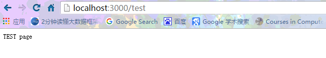
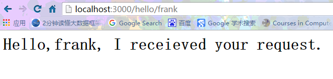

# URL

在`hello-koa`工程中，我们处理`http`请求一律返回相同的`HTML`，这样虽然非常简单，但是用浏览器一测，随便输入任何`URL`都会返回相同的网页。


正常情况下，我们应该对不同的`URL`调用不同的处理函数，这样才能返回不同的结果。例如像这样写：

```javascript
//对应的代码文件:app.js
app.use(async (ctx, next) => {
    if (ctx.request.path === '/') {
        ctx.response.body = 'index page';
    } else {
        await next();
    }
});

app.use(async (ctx, next) => {
    if (ctx.request.path === '/test') {
        ctx.response.body = 'TEST page';
    } else {
        await next();
    }
});

app.use(async (ctx, next) => {
    if (ctx.request.path === '/error') {
        ctx.response.body = 'ERROR page';
    } else {
        await next();
    }
});

```
在命令行中运行：
```
Administrator@XB-201606171743 MINGW64 /d/nodejs/nodejs-learning/web/koa/koa-url (master)
$ ls
app.js  budongjin.png  node_modules/  package.json  README.md  start.js

Administrator@XB-201606171743 MINGW64 /d/nodejs/nodejs-learning/web/koa/koa-url (master)
$ npm start

> koa-url@1.0.0 start D:\nodejs\nodejs-learning\web\koa\koa-url
> node start.js

the web app is listen at port 3000, open http://localhost:30000 in browser....
```

在浏览器中访问





这么写是可以运行的，但是好像有点蠢。

应该有一个能集中处理`URL`的`middleware`，它根据不同的`URL`调用不同的处理函数，这样，我们才能专心为每个`URL`编写处理函数。

## koa-router

为了处理`URL`，我们需要引入`koa-router`这个`middleware`，让它负责处理`URL映射`。

我们把上一节的`hello-koa`工程复制一份，重命名为`koa-url`。

先在package.json中添加依赖项：
```
"koa-router": "7.0.0"
```
然后用npm install安装。
```
Administrator@XB-201606171743 MINGW64 /d/nodejs/nodejs-learning/web/koa/koa-url (master)
$ npm install
koa-url@1.0.0 D:\nodejs\nodejs-learning\web\koa\koa-url
`-- koa-router@7.0.0
  +-- methods@1.1.2
  `-- path-to-regexp@1.5.3
    `-- isarray@0.0.1

npm WARN koa-url@1.0.0 No repository field.
```
接下来，我们编写`appWithKoaRouter.js`，使用`koa-router`来处理`URL`：
```javascript
//对应的代码文件：appWithKoaRouter.js
const Koa = require('koa');

// 注意require('koa-router')返回的是函数:
const router = require('koa-router')();

const app = new Koa();

// log request URL:
app.use(async (ctx, next) => {
    console.log(`Process ${ctx.request.method} ${ctx.request.url}...`);
    await next();
});

// add url-route:
router.get('/hello/:name', async (ctx, next) => {
    var name = ctx.params.name;
    ctx.response.body = `<h1>Hello, ${name}!</h1>`;
});

router.get('/', async (ctx, next) => {
    ctx.response.body = '<h1>Index</h1>';
});

// add router middleware:
app.use(router.routes());

app.listen(3000);
console.log('app started at port 3000...');
```

注意导入`koa-router`的语句最后的()是函数调用：
```javascript
const router = require('koa-router')();
```
相当于：
```javascript
const fn_router = require('koa-router');
const router = fn_router();
```
然后，我们使用`router.get('/path', async fn)`来注册一个`GET请求`。可以在请求路径中使用带变量的`/hello/:name`，变量可以通过`ctx.params.name`访问。

修改`start.js`中最后一行的`require`为：
```javascript
//后面的require都会被babel的require替换
require('./appWithMiddleware.js');
```

再运行`start.js`，我们就可以测试不同的`URL`：
```
Administrator@XB-201606171743 MINGW64 /d/nodejs/nodejs-learning/web/koa/koa-url (master)
$ npm start

> koa-url@1.0.0 start D:\nodejs\nodejs-learning\web\koa\koa-url
> node start.js

the web app is listen at port 3000, open http://localhost:30000 in browser....
```

输入首页：http://localhost:3000/


输入：http://localhost:3000/hello/koa



命令行输出：
```
Administrator@XB-201606171743 MINGW64 /d/nodejs/nodejs-learning/web/koa/koa-url (master)
$ npm start

> koa-url@1.0.0 start D:\nodejs\nodejs-learning\web\koa\koa-url
> node start.js

the web app is listen at port 3000, open http://localhost:30000 in browser....
当前请求的url:/
当前请求的url:/hello/frank
当前请求的url:/hello/frank
```

## 处理post请求

用`router.get('/path', async fn)`处理的是`get`请求。如果要处理`post请求`，可以用`router.post('/path', async fn)`。

用`post`请求处理`URL`时，我们会遇到一个问题：`post`请求通常会发送一个表单，或者`JSON`，它作为`request`的`body`发送，但无论是`Node.js`提供的原始`request`对象，还是`koa`提供的`request`对象，都不提供解析`request`的`body`的功能！

所以，我们又需要引入另一个`middleware`来解析原始`request`请求，然后，把解析后的参数，绑定到`ctx.request.body`中。

`koa-bodyparser`就是用来干这个活的。

我们在`package.json`中添加依赖项：
```javascript
"koa-bodyparser": "3.2.0"
```
然后使用npm install安装。
```npm
Administrator@XB-201606171743 MINGW64 /d/nodejs/nodejs-learning/web/koa/koa-url (master)
$ npm install
koa-url@1.0.0 D:\nodejs\nodejs-learning\web\koa\koa-url
`-- koa-bodyparser@3.2.0
  `-- co-body@4.2.0
    +-- inflation@2.0.0
    +-- qs@4.0.0
    `-- raw-body@2.1.7
      +-- bytes@2.4.0
      +-- iconv-lite@0.4.13
      `-- unpipe@1.0.0

npm WARN koa-url@1.0.0 No repository field.
```


下面，修改`app.js`，引入`koa-bodyparser`：
```javascript
const bodyParser = require('koa-bodyparser');
```
在合适的位置加上：
```javascript
app.use(bodyParser());
```
由于`middleware`的顺序很重要，这个`koa-bodyparser`必须在`router`之前被注册到`app`对象上。

现在我们就可以处理post请求了。写一个简单的登录表单：
```javascript
router.get('/', async (ctx, next) => {
    ctx.response.body = `<h1>Index</h1>
        <form action="/signin" method="post">
            <p>Name: <input name="name" value="koa"></p>
            <p>Password: <input name="password" type="password"></p>
            <p><input type="submit" value="Submit"></p>
        </form>`;
});

router.post('/signin', async (ctx, next) => {
    var
        name = ctx.request.body.name || '',
        password = ctx.request.body.password || '';
    console.log(`signin with name: ${name}, password: ${password}`);
    if (name === 'koa' && password === '12345') {
        ctx.response.body = `<h1>Welcome, ${name}!</h1>`;
    } else {
        ctx.response.body = `<h1>Login failed!</h1>
        <p><a href="/">Try again</a></p>`;
    }
});
```
注意到我们用`var name = ctx.request.body.name || ''`拿到表单的`name`字段，如果该字段不存在，默认值设置为`''`。

类似的，`put`、`delete`、`head`请求也可以由`router`处理。
为了便于演示，上面调整的代码，放在`appWithBodyParser.js`中，并修改`start`中的`require`。
```
Administrator@XB-201606171743 MINGW64 /d/nodejs/nodejs-learning/web/koa/koa-url (master)
$ npm start

> koa-url@1.0.0 start D:\nodejs\nodejs-learning\web\koa\koa-url
> node start.js

the web app is listen at port 3000, open http://localhost:30000 in browser....
```
在浏览器中访问'http://localhost:3000/login/'


输入用户名`frank`和密码`sa123`


命令行的输出
```
Administrator@XB-201606171743 MINGW64 /d/nodejs/nodejs-learning/web/koa/koa-url (master)
$ npm start

> koa-url@1.0.0 start D:\nodejs\nodejs-learning\web\koa\koa-url
> node start.js

the web app is listen at port 3000, open http://localhost:30000 in browser....
sign in with name:frank,password:sa123
```

## 重构

现在，我们已经可以处理不同的`URL`了，但是看看`app.js`，总觉得还是有点不对劲。


所有的`URL`处理函数都放到`app.js`里显得很乱，而且，每加一个`URL`，就需要修改`app.js`。随着`URL`越来越多，`app.js`就会越来越长。

如果能把`URL`处理函数集中到某个`js`文件，或者某几个`js`文件中就好了，然后让`app.js`自动导入所有处理`URL`的函数。这样，代码一分离，逻辑就显得清楚了。最好是这样：
```uml
url2-koa/
|
+- .vscode/
|  |
|  +- launch.json <-- VSCode 配置文件
|
+- controllers/
|  |
|  +- login.js <-- 处理login相关URL
|  |
|  +- hello.js <-- 处理用户管理相关URL
|
+- app.js <-- 使用koa的js
|
+- start.js <-- 启动入口js
|
+- package.json <-- 项目描述文件
|
+- node_modules/ <-- npm安装的所有依赖包
```
于是我们把`koa-url`复制一份，重命名为`koa-url2`，准备重构这个项目。

我们先在`controllers`目录下编写`login.js`：
```javascript
var fn_index = async (ctx, next) => {
    ctx.response.body = `<h1>Index</h1>
        <form action="/signin" method="post">
            <p>Name: <input name="name" value="koa"></p>
            <p>Password: <input name="password" type="password"></p>
            <p><input type="submit" value="Submit"></p>
        </form>`;
};

var fn_signin = async (ctx, next) => {
    var
        name = ctx.request.body.name || '',
        password = ctx.request.body.password || '';
    console.log(`signin with name: ${name}, password: ${password}`);
    if (name === 'koa' && password === '12345') {
        ctx.response.body = `<h1>Welcome, ${name}!</h1>`;
    } else {
        ctx.response.body = `<h1>Login failed!</h1>
        <p><a href="/">Try again</a></p>`;
    }
};

module.exports = {
    'GET /': fn_index,
    'POST /signin': fn_signin
};
```
这个`logion.js`通过`module.exports`把两个`URL`处理函数暴露出来。

类似的，`hello.js`把一个`URL`处理函数暴露出来：
```javascript
var fn_hello = async (ctx, next) => {
    var name = ctx.params.name;
    ctx.response.body = `<h1>Hello, ${name}!</h1>`;
};

module.exports = {
    'GET /hello/:name': fn_hello
};
```
现在，我们修改`app.js`，让它自动扫描`controllers`目录，找到所有`js`文件，导入，然后注册每个`URL`：
```javascript
// 先导入fs模块，然后用readdirSync列出文件
// 这里可以用sync是因为启动时只运行一次，不存在性能问题:
var files = fs.readdirSync(__dirname + '/controllers');

// 过滤出.js文件:
var js_files = files.filter((f)=>{
    return f.endsWith('.js');
}, files);

// 处理每个js文件:
for (var f of js_files) {
    console.log(`process controller: ${f}...`);
    // 导入js文件:
    let mapping = require(__dirname + '/controllers/' + f);
    for (var url in mapping) {
        if (url.startsWith('GET ')) {
            // 如果url类似"GET xxx":
            var path = url.substring(4);
            router.get(path, mapping[url]);
            console.log(`register URL mapping: GET ${path}`);
        } else if (url.startsWith('POST ')) {
            // 如果url类似"GET xxx":
            var path = url.substring(5);
            router.post(path, mapping[url]);
            console.log(`register URL mapping: POST ${path}`);
        } else {
            // 无效的URL:
            console.log(`invalid URL: ${url}`);
        }
    }
}
```
如果上面的大段代码看起来还是有点费劲，那就把它拆成更小单元的函数：
```javascript
function addMapping(router, mapping) {
    for (var url in mapping) {
        if (url.startsWith('GET ')) {
            var path = url.substring(4);
            router.get(path, mapping[url]);
            console.log(`register URL mapping: GET ${path}`);
        } else if (url.startsWith('POST ')) {
            var path = url.substring(5);
            router.post(path, mapping[url]);
            console.log(`register URL mapping: POST ${path}`);
        } else {
            console.log(`invalid URL: ${url}`);
        }
    }
}
function addControllers(router) {
    var files = fs.readdirSync(__dirname + '/controllers');
    var js_files = files.filter((f) => {
        return f.endsWith('.js');
    }, files);

    for (var f of js_files) {
        console.log(`process controller: ${f}...`);
        let mapping = require(__dirname + '/controllers/' + f);
        addMapping(router, mapping);
    }
}
addControllers(router);
```
确保每个函数功能非常简单，一眼能看明白，是代码可维护的关键。

经过重新整理后的工程`url2-koa`目前具备非常好的模块化，所有处理`URL`的函数按功能组存放在`controllers`目录，今后我们也只需要不断往这个目录下加东西就可以了，`app.js`保持不变。

对应的命令行信息
### npm install
```
Administrator@XB-201606171743 MINGW64 /d/nodejs/nodejs-learning/web/koa/koa-url2 (master)
$ ls
app.js         controllers/  p2.png  p4.png  p6.png  package.json  start.js
budongjin.png  p1.png        p3.png  p5.png  p7.png  README.md
c
Administrator@XB-201606171743 MINGW64 /d/nodejs/nodejs-learning/web/koa/koa-url2 (master)
$ npm install
koa-url@1.0.0 D:\nodejs\nodejs-learning\web\koa\koa-url2
+-- babel-core@6.13.2
| +-- babel-code-frame@6.11.0
| | +-- chalk@1.1.3
| | | +-- ansi-styles@2.2.1
| | | +-- escape-string-regexp@1.0.5
| | | +-- has-ansi@2.0.0
| | | | `-- ansi-regex@2.0.0
| | | +-- strip-ansi@3.0.1
| | | `-- supports-color@2.0.0
| | +-- esutils@2.0.2
| | `-- js-tokens@2.0.0
| +-- babel-generator@6.14.0
| | `-- detect-indent@3.0.1
| |   +-- get-stdin@4.0.1
| |   +-- minimist@1.2.0
| |   `-- repeating@1.1.3
| |     `-- is-finite@1.0.1
| |       `-- number-is-nan@1.0.0
| +-- babel-helpers@6.8.0
| +-- babel-messages@6.8.0
| +-- babel-register@6.14.0
| | +-- babel-core@6.14.0
| | +-- home-or-tmp@1.0.0
| | | +-- os-tmpdir@1.0.1
| | | `-- user-home@1.1.1
| | +-- mkdirp@0.5.1
| | | `-- minimist@0.0.8
| | `-- source-map-support@0.2.10
| |   `-- source-map@0.1.32
| |     `-- amdefine@1.0.0
| +-- babel-runtime@6.11.6
| +-- babel-template@6.14.0
| +-- babel-traverse@6.14.0
| | +-- globals@8.18.0
| | `-- invariant@2.2.1
| |   `-- loose-envify@1.2.0
| |     `-- js-tokens@1.0.3
| +-- babel-types@6.14.0
| | `-- to-fast-properties@1.0.2
| +-- babylon@6.9.1
| +-- convert-source-map@1.3.0
| +-- debug@2.2.0
| | `-- ms@0.7.1
| +-- json5@0.4.0
| +-- lodash@4.15.0
| +-- minimatch@3.0.3
| | `-- brace-expansion@1.1.6
| |   +-- balanced-match@0.4.2
| |   `-- concat-map@0.0.1
| +-- path-exists@1.0.0
| +-- path-is-absolute@1.0.0
| +-- private@0.1.6
| +-- shebang-regex@1.0.0
| +-- slash@1.0.0
| `-- source-map@0.5.6
+-- babel-polyfill@6.13.0
| +-- core-js@2.4.1
| `-- regenerator-runtime@0.9.5
+-- babel-preset-es2015-node6@0.3.0
| +-- babel-plugin-transform-es2015-destructuring@6.9.0
| +-- babel-plugin-transform-es2015-function-name@6.9.0
| | `-- babel-helper-function-name@6.8.0
| +-- babel-plugin-transform-es2015-modules-commonjs@6.14.0
| | `-- babel-plugin-transform-strict-mode@6.11.3
| `-- babel-plugin-transform-es2015-parameters@6.11.4
|   +-- babel-helper-call-delegate@6.8.0
|   | `-- babel-helper-hoist-variables@6.8.0
|   `-- babel-helper-get-function-arity@6.8.0
+-- babel-preset-stage-3@6.5.0
| +-- babel-plugin-transform-async-to-generator@6.8.0
| | +-- babel-helper-remap-async-to-generator@6.11.2
| | `-- babel-plugin-syntax-async-functions@6.13.0
| `-- babel-plugin-transform-exponentiation-operator@6.8.0
|   +-- babel-helper-builder-binary-assignment-operator-visitor@6.8.0
|   | `-- babel-helper-explode-assignable-expression@6.8.0
|   `-- babel-plugin-syntax-exponentiation-operator@6.13.0
+-- koa@2.0.0
| +-- accepts@1.3.3
| | `-- negotiator@0.6.1
| +-- content-disposition@0.5.1
| +-- content-type@1.0.2
| +-- cookies@0.6.1
| | `-- keygrip@1.0.1
| +-- delegates@1.0.0
| +-- depd@1.1.0
| +-- destroy@1.0.4
| +-- error-inject@1.0.0
| +-- escape-html@1.0.3
| +-- fresh@0.3.0
| +-- http-assert@1.2.0
| | +-- deep-equal@1.0.1
| | `-- http-errors@1.4.0
| +-- http-errors@1.5.0
| | +-- inherits@2.0.1
| | `-- setprototypeof@1.0.1
| +-- is-generator-function@1.0.3
| +-- koa-compose@3.1.0
| | `-- any-promise@1.3.0
| +-- koa-convert@1.2.0
| | `-- co@4.6.0
| +-- koa-is-json@1.0.0
| +-- mime-types@2.1.11
| | `-- mime-db@1.23.0
| +-- on-finished@2.3.0
| | `-- ee-first@1.1.1
| +-- only@0.0.2
| +-- parseurl@1.3.1
| +-- statuses@1.3.0
| +-- type-is@1.6.13
| | `-- media-typer@0.3.0
| `-- vary@1.1.0
+-- koa-bodyparser@3.2.0
| `-- co-body@4.2.0
|   +-- inflation@2.0.0
|   +-- qs@4.0.0
|   `-- raw-body@2.1.7
|     +-- bytes@2.4.0
|     +-- iconv-lite@0.4.13
|     `-- unpipe@1.0.0
`-- koa-router@7.0.0
  +-- methods@1.1.2
  `-- path-to-regexp@1.5.3
    `-- isarray@0.0.1

npm WARN koa-url@1.0.0 No repository field.
```

### npm start
```
$ npm start

> koa-url@1.0.0 start D:\nodejs\nodejs-learning\web\koa\koa-url2
> node start.js

process controllers: hello.js
register URL mapping: GET /hello/:name
process controllers: login.js
register URL mapping: GET /
register URL mapping: POST /signin
the web app is listen at port 3000, open http://localhost:30000 in browser....
```
浏览器访问验证:


命令行输出
```javascript
Administrator@XB-201606171743 MINGW64 /d/nodejs/nodejs-learning/web/koa/koa-url2 (master)
$ npm start
> koa-url@1.0.0 start D:\nodejs\nodejs-learning\web\koa\koa-url2
> node start.js

process controllers: hello.js
register URL mapping: GET /hello/:name
process controllers: login.js
register URL mapping: GET /
register URL mapping: POST /signin
the web app is listen at port 3000, open http://localhost:30000 in browser....
Say: Receieve request at url:/
Say: Receieve request at url:/signin
sign in with name:frank,password:sa123
Say: Receieve request at url:/hello/frank
Say: Receieve request at url:/hello/frank
```
